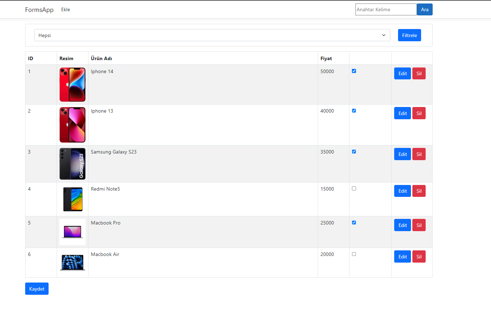
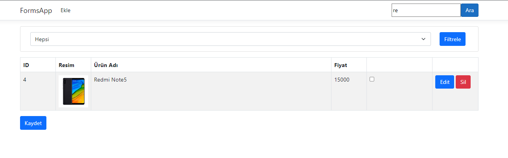
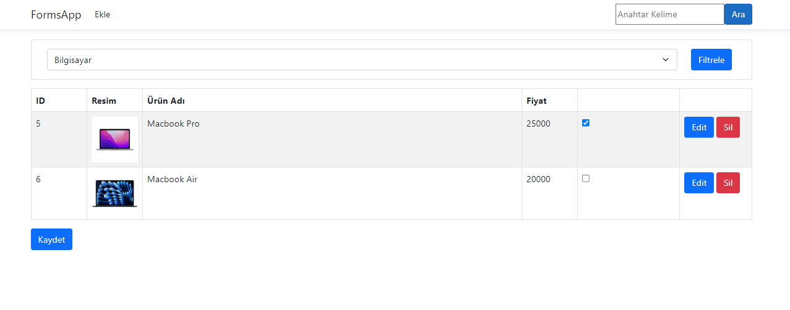
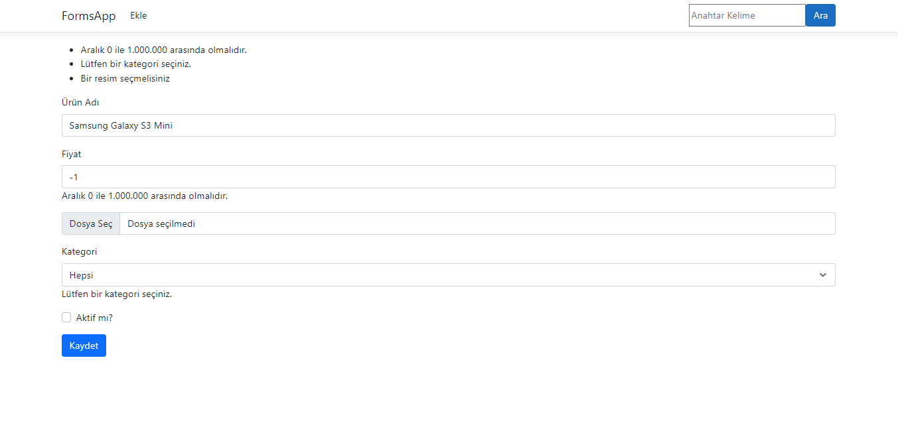
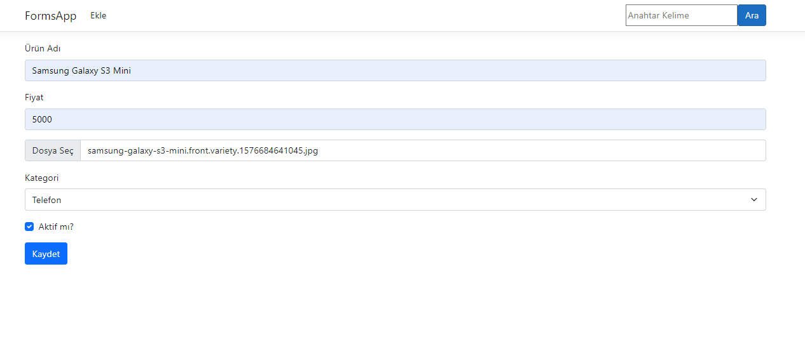
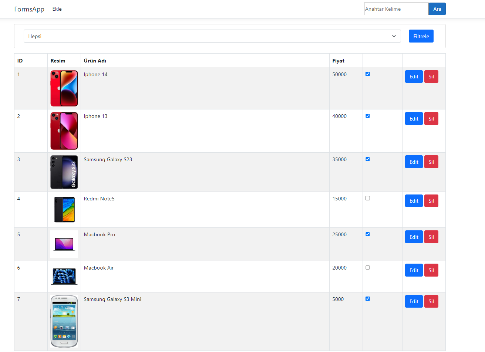
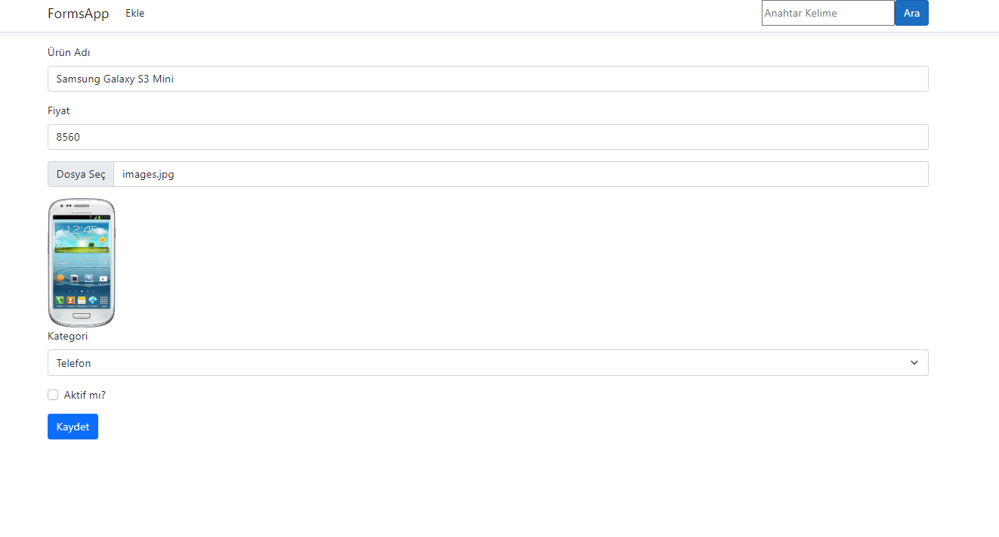
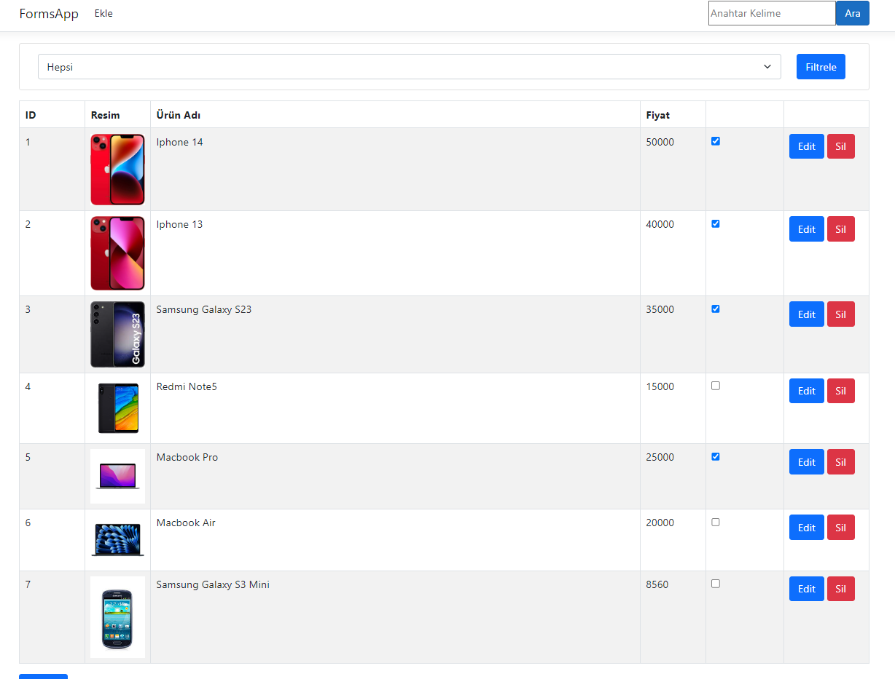
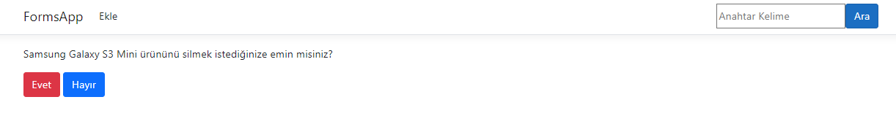
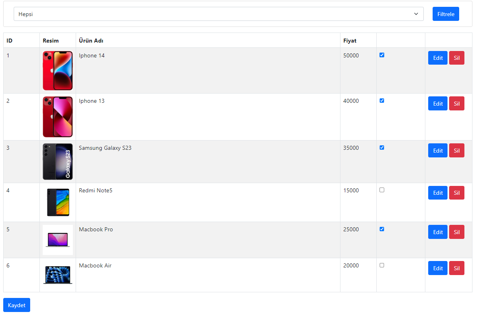

# Product Management App

Proje, .NET Core MVC kullanılarak geliştirilmiş bir web uygulamasıdır. Bu uygulama, kullanıcıların ürünleri listeleyebileceği, yeni ürünler ekleyebileceği, mevcut ürünleri silebileceği ve ürünleri arayabileceği bir platform sunar. Başlangıçta tüm ürünler listelenir ve kullanıcılar üstteki arama çubuğunu kullanarak istedikleri ürünleri bulabilirler. Ayrıca, kategoriye göre filtreleme yaparak ilgili ürünleri görüntüleyebilirler. Bu sayede kullanıcılar istedikleri ürünleri daha kolay bir şekilde bulabilir ve erişebilirler. Uygulama aynı zamanda ürünleri düzenleme ve silme işlemlerini de içerir.

The project is a web application developed using .NET Core MVC. This application allows users to list products, add new ones, delete existing ones, and search for products. Initially, all products are listed, and users can find the desired products using the search bar at the top. Additionally, they can filter products by category to view relevant items. This enables users to easily find and access the products they are looking for. The application also includes functionality for editing and deleting products. (EN)

## Proje İçeriği - Project Content

- Form
- Get Form
- Post Form
- Form Tag Helpers 
- Model Bindings
- Form Validations
- File Upload
- Create Form
- Edit Form
- Model Binding
- Delete Entity
- Batch Update

# Proje Ekran Görüntüleri (Screenshots)

## Ürünlerin Listelenmesi:

## Arama kısmından ürünün aranması:

## Kategori kısmından ürünün filtrelenmesi:

## Validasyonların gösterilmesi:

## Yeni ürün ekleme:

## Yeni ürünün listelenmesi:

## Yeni ürünün güncellenmesi (Örnek olarak fiyat bilgisi ve fotoğraf değiştirildi..)

## Güncellenmiş ürünün listelenmesi

## Ürün silinmek istendiğinde uyarı ekranı çıkartılması:

## Ürün silindikten sonra listelenme işlemi:

